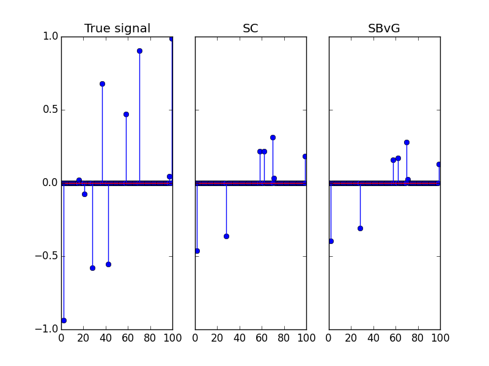

# Smoothed Concomitant Lasso


This package implements a simple scikit-learn style estimator for the Smoothed Concomitant Lasso https://arxiv.org/abs/1606.02702.

## Motivation

Automated noise level estimatotion can be of interest in high dimension, for instance when uncertainty quantification is required, as well as when no cross-validation can be performed to tune the regularization parameter.

## Example

The API of the ``smoothconco`` code is designed for compatibility with the [scikit-learn](http://scikit-learn.org) project.

```python
import numpy as np
import matplotlib.pyplot as plt
from smoothed_concomitant import SC_path
from SBvG import SBvG_path
from data_generation import generate_data

# Generate dataset

n_samples = 100
n_features = 100
sigma = 2
sparsity = 0.9
snr = 1
correlation = 0.5
random_state = 42

X, y, true_beta, true_sigma = generate_data(n_samples, n_features, sigma, snr,
                                            sparsity, correlation,
                                            random_state=random_state)

# regularization parameter for sigma estimation
sigma_0 = (np.linalg.norm(y) / np.sqrt(n_samples)) * 1e-2
sigstar = max(sigma_0, np.linalg.norm(y) / np.sqrt(n_samples))
lambda_max = np.linalg.norm(np.dot(X.T, y), ord=np.inf) / (n_samples * sigstar)

# SC
clf = SCRegressor(lambdas=[lambda_max / 1.5], eps=1e-4)
clf.fit(X, y)
betas, sigmas = clf.betas, clf.sigmas

# SBvG
betas_SBvG, sigmas_SBvG = SBvG_path(X, y, [lambda_max / 1.5])


fig, axes = plt.subplots(ncols=3, sharey=True)

axes[0].stem(true_beta)
axes[0].set_title("True signal")
axes[1].stem(betas[0])
axes[1].set_title("SC")
axes[2].stem(betas_SBvG[0])
axes[2].set_title("SBvG")

plt.show()


plt.savefig("test_SC.png", format="png")

# Sigma performance:
print("Sigma estimation:")
print("True sigma")
print(sigma)

print "hatsigma for SC"
print(sigmas[0])

print "hatsigma for SBvG"
print(sigmas_SBvG[0])

# Beta performance
print("Estimation risk")
print("SC")
print(np.linalg.norm(true_beta - betas[0]) / n_features)
print("SBvG")
print(np.linalg.norm(true_beta - betas_SBvG[0]) / n_features)
```




## Installation & Requirements

The ``smoothconco`` package itself is fairly lightweight. It is tested on Python 2.7 and 3.4-3.5, and depends on the following packages:

- [numpy](http://numpy.org)
- [scipy](http://scipy.org)
- [scikit-learn](http://scikit-learn.org)
- [cython](http://cython.org/)

Using the cross-platform [conda](http://conda.pydata.org/miniconda.html)
package manager, these requirements can be installed as follows:

```
$ conda install numpy scipy scikit-learn cython
```

To install ``smoothconco`` from source, first download the source repository and then run


```
$ pip install -e .
```
